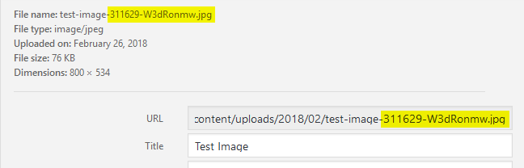

# WordPress Plugin

## Unique Uploaded Media Name

Unique uploaded media names by adding some extra random string

Current Version: 1.0
 
Author: Sazzad Hossain Sharkar
 
Author URI: <https://github.com/shsbd>

## Screenshot

## Features

* Adds unique suffix at the end of the uploaded file name. e.g.: test-image-`311629-W3dRonmw`.jpg
* Generated strings are very unique and less possibility of confliction
* Remove Accents `Convert to ASCII`
* Crypto Rand Secure with `openssl_random_pseudo_bytes`
* Added more extra switch conditions to use other string generator. (`Numeric`, `Alpha Numeric`, `No Zero Numeric`, `All String`, `Hexadecimal`, `Capital`, `Alpha` and `Distinct`). Just edit line number `74` and `75`.
* converts unnecessary space, underscore and special characters to hyphen character.
* Consumes very low memory
* Single file `less than 3KB`
* Open source license, modify and distribute with your own. `GNU GPLv3`
* Tested with `WordPress 4.9.4`

## Download Source Code
Download from, <https://github.com/aifdn/unique-uploaded-media-name/archive/master.zip>

## Installation

1. Upload the entire `unique-uploaded-media-name` folder to the `/wp-content/plugins/` directory. (If the folder name changes, rename the folder name with your own.)
2. Activate the plugin through the ‘Plugins’ menu in WordPress.

## Contribution

If you would like to add some extra features, just fork the repository, edit and make a pull request.

## I have questions to ask

Just send an email to <mailto:sharkar@akhaura.info> . I will be happy to answer your queries.

## License

[GNU General Public License v3.0](LICENSE)
